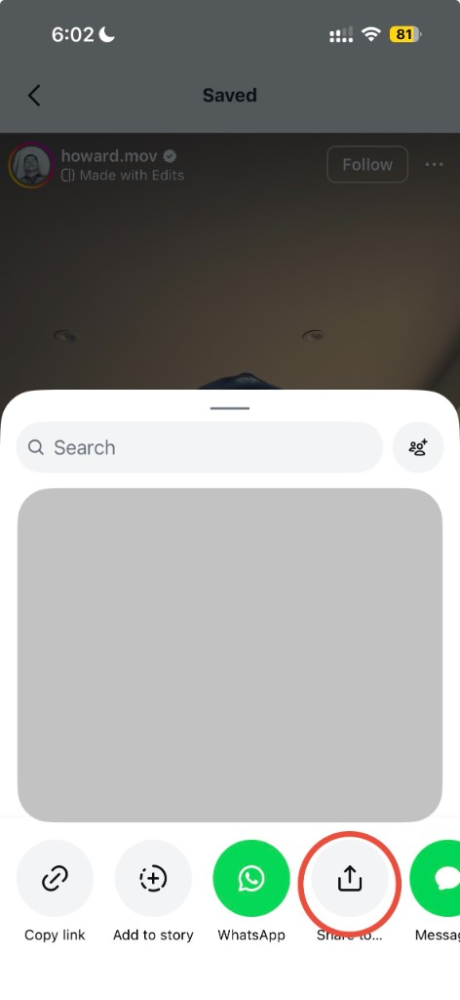
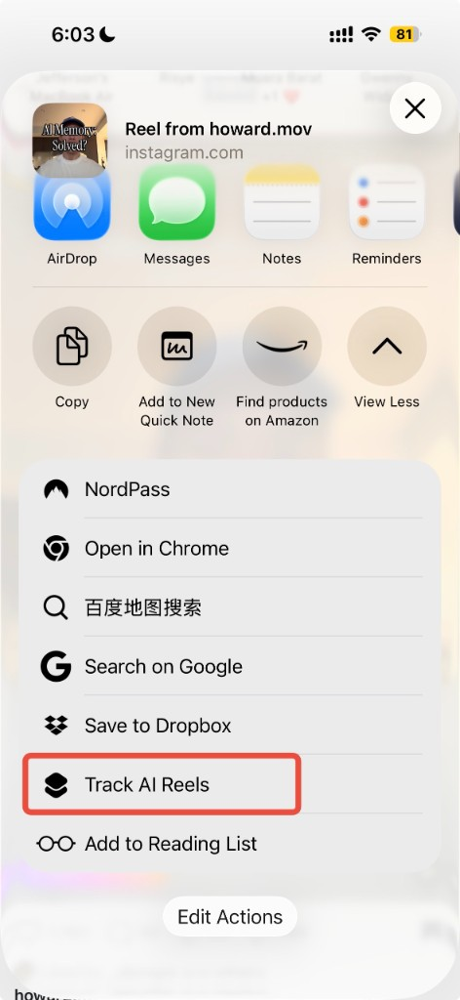
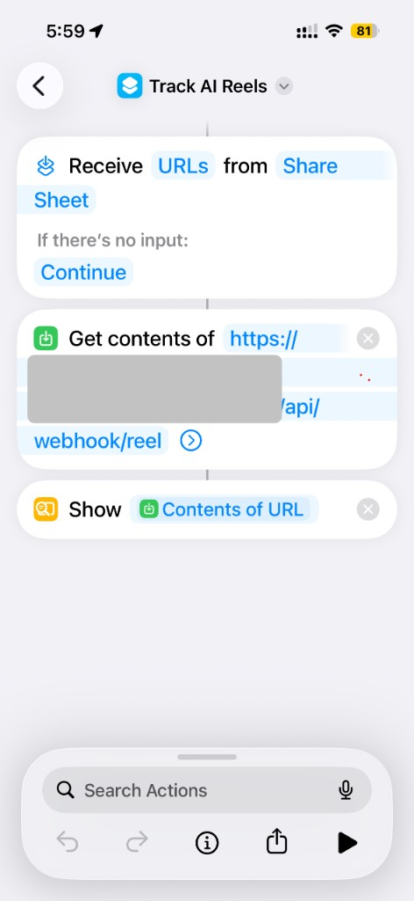
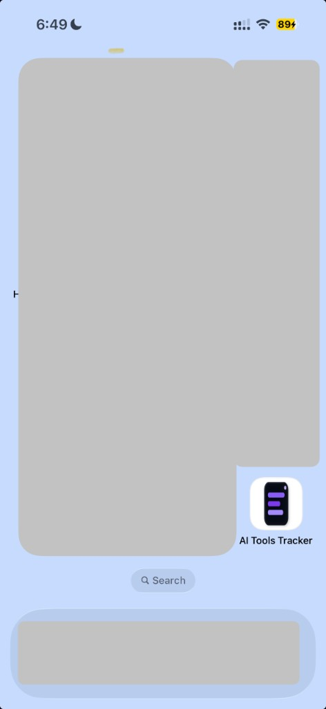
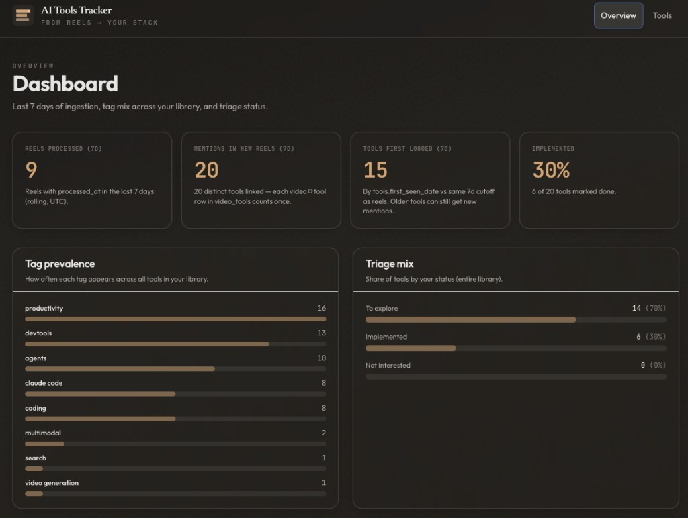
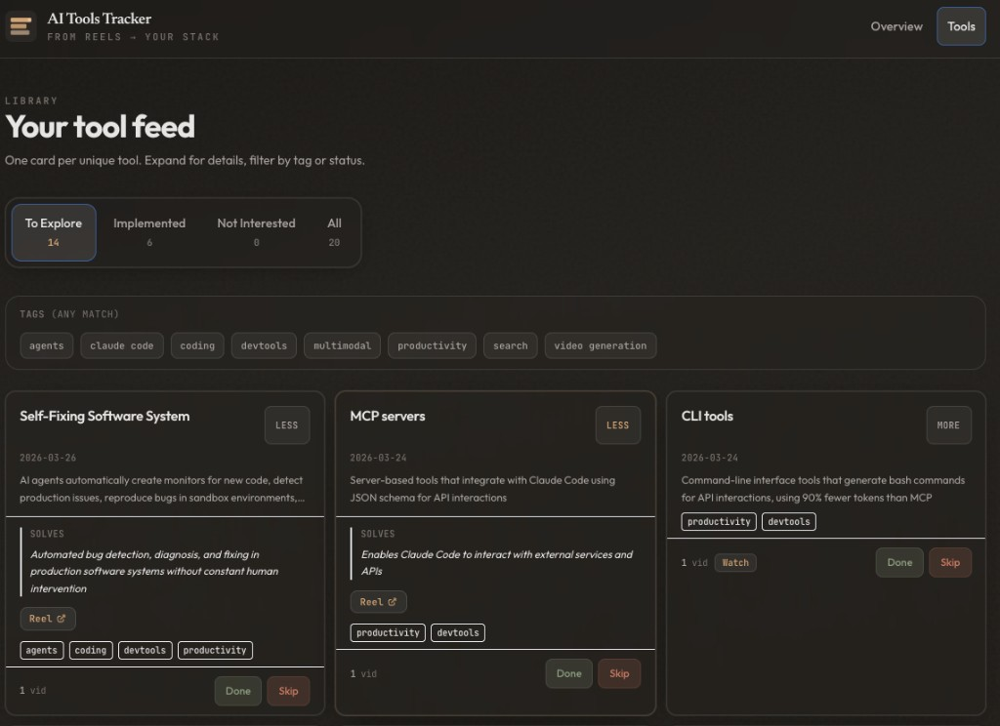
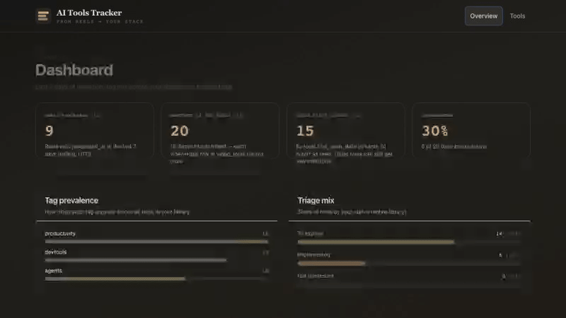

# AI Tools Tracker

## Objective

**Capture AI tools mentioned in Instagram Reels and turn them into a searchable list you can triage in a browser.**  
Send a Reel URL (iOS Shortcut sharing the link, or a direct `POST` to the webhook). The service downloads audio, transcribes it, asks Claude to extract structured tool records, merges duplicates in **Supabase**, and serves a small web app where you mark each tool as *to explore*, *implemented*, or *not interested*.

This is a **personal** project: one owner, service-role access to the database, no multi-user auth. The goal is low cost, low maintenance, and logic you can change in code.

---

## How it works

1. **Input** — You share a Reel URL to your Shortcut (or call the webhook from `curl`). The backend receives `POST /api/webhook/reel` with the URL and a shared secret.
2. **Pipeline** — Audio is pulled with **yt-dlp** (metadata includes the Reel **caption** when Instagram exposes it). **AssemblyAI** transcribes the audio. **Claude** turns transcript + caption into structured tool rows; when the caption spells a product name and the transcript mis-hears it, the extractor prefers the **caption spelling** for the tool `name`. Rows are deduplicated against existing tools in Postgres.
3. **Storage** — **Supabase** holds videos, tools, links between them, and your per-tool status/notes.
4. **UI** — **React** (Vite + Tailwind): **Overview** shows recent ingestion metrics; **Tools** lists the library with status tabs, **tag filters**, a **search** box (backed by `GET /api/tools?q=…`), and links to each source Reel / transcript where applicable.

---

## Screenshots

### From Instagram to your API (iOS)

From a Reel, open **Share** → **Share to…** → choose **Track AI Reels** (Shortcuts). The shortcut posts the URL to `/api/webhook/reel` on your deployed backend.

| Share | Choose the shortcut |
|------|----------------------|
|  |  |

**Shortcut** — Receive URLs from the Share Sheet, `POST` to your API, show the response:



**Home screen** — Add the deployed site to your iPhone home screen (Safari → Share → *Add to Home Screen*) for one-tap access to the web app alongside the Reel-capture shortcut:



### Web app

**Overview** — 7-day ingestion and tag/triage summary. **Tools** — library with status tabs, search, and tags.

| Overview | Tools |
|----------|-------|
|  |  |



---

## Tech stack

| Layer | Choice |
|--------|--------|
| Backend | FastAPI · Python 3.12 · `uv` |
| Database | Supabase (Postgres) |
| Frontend | React · Vite · Tailwind CSS |
| Hosting (typical) | Railway (API) · Vercel (UI) |

---

## Repository layout

| Path | Purpose |
|------|---------|
| `backend/` | FastAPI app, webhook, ingestion, transcription, extraction, dedup, SQL migrations |
| `frontend/` | React UI (Overview, Tools, video detail) |
| `docs/screenshots/` | Images and demo GIF for this README |
| `scripts/record-demo-gif.sh` | Optional: convert a recorded browser video to `docs/screenshots/demo.gif` (see `ffmpeg` in script) |
| `CLAUDE.md` | Project instructions for AI coding agents |
| `agent.md` | Short pointer for generic agents |
| `DEPLOYMENT.md` | Production deploy (Railway + Vercel + Shortcut) |

---

## Table of contents

1. [How it works](#how-it-works)
2. [Screenshots](#screenshots)
3. [Tech stack](#tech-stack)
4. [Repository layout](#repository-layout)
5. [Prerequisites](#1-prerequisites)
6. [Supabase (database)](#2-supabase-setup-from-scratch)
7. [Backend API](#3-backend-setup) — [Verify Reel caption (yt-dlp)](#verify-reel-caption-yt-dlp)
8. [Frontend](#4-frontend-setup)
9. [Webhook smoke test](#5-api-smoke-test-webhook--after-diagnostics-pass)
10. [iOS Shortcut](#6-ios-shortcut-setup)
11. [Optional Telegram](#7-optional-telegram-fallback)
12. [Tests](#8-tests)
13. [Deployment](#9-deployment)
14. [Roadmap](#v2-roadmap)

---

## 1) Prerequisites

- Python 3.12+ (backend targets 3.12)
- Node.js 18+
- Accounts / keys: Supabase, Anthropic, AssemblyAI; hosting for API and UI (e.g. Railway, Vercel); optional Telegram bot

---

## 2) Supabase Setup (From Scratch)

1. Create a Supabase project.
2. In **SQL Editor**, run `backend/db/migrations/001_initial.sql`, then `002_processing_error.sql`, then `003_caption.sql` (adds `videos.caption` from Reel metadata for better tool names).
3. Enable RLS on `videos`, `tools`, `video_tools`, `user_interactions`.
4. **Personal-app pattern:** add a policy so the backend (using the **service role** key) can read/write all rows, e.g. name `service_role_all`, actions all, condition `auth.role() = 'service_role'`.
5. Copy **Project URL** → `SUPABASE_URL`, **service role key** → `SUPABASE_SERVICE_KEY` in `backend/.env`.

---

## 3) Backend Setup

```bash
cd backend
cp .env.example .env
```

Fill `backend/.env`:

```env
SUPABASE_URL=
SUPABASE_SERVICE_KEY=
ASSEMBLYAI_API_KEY=
ANTHROPIC_API_KEY=
TELEGRAM_BOT_TOKEN=
WEBHOOK_SECRET=
```

Run locally:

```bash
uv run uvicorn main:app --host 0.0.0.0 --port 8000 --reload
```

Health:

```bash
curl http://localhost:8000/health
```

### Before you trust the full pipeline

Run in order:

| Step | What | URL / command |
|------|------|----------------|
| 1 | Health | `GET http://localhost:8000/health` |
| 2 | AssemblyAI key | `GET http://localhost:8000/api/diagnostics/assemblyai` |
| 3 | Full diagnostics JSON | `GET http://localhost:8000/api/diagnostics/summary` |
| 4 | Ingest a Reel | `POST /api/webhook/reel` (see [§5](#5-api-smoke-test-webhook--after-diagnostics-pass)) |

```bash
curl -s http://localhost:8000/api/diagnostics/assemblyai | python3 -m json.tool
curl -s http://localhost:8000/api/diagnostics/summary | python3 -m json.tool
```

- If `/api/diagnostics/assemblyai` returns `"ok": true`, the transcription step is safe to run.
- If `"ok": false`, fix `ASSEMBLYAI_API_KEY` in `.env` (no stray spaces), restart uvicorn, retry step 2.

### Tools API (list + search)

- `GET /api/tools?status=to_explore|implemented|not_interested|all` — tools in that triage bucket.
- Optional `q` — case-insensitive substring on name, functionality, problem_solved, tags, and notes.

```bash
curl -s "http://localhost:8000/api/tools?status=all&q=mcp" | python3 -m json.tool
```

### Verify Reel caption (yt-dlp)

This checks that Instagram still exposes a **caption** (`description`) for a Reel using the same **yt-dlp** path as the downloader — no AssemblyAI or Anthropic calls.

Example (run from `backend/`; needs network):

```bash
cd backend
uv run python <<'PY'
from yt_dlp import YoutubeDL
from services.downloader import _caption_from_ytdlp_info

url = "https://www.instagram.com/reel/DWIEsK7Ee-b/?igsh=bjZ3a2NucnRhbjJz"
opts = {"quiet": True, "no_warnings": True, "skip_download": True}
with YoutubeDL(opts) as ydl:
    info = ydl.extract_info(url, download=False)
cap = _caption_from_ytdlp_info(info)
print("caption_chars:", len(cap or ""))
print((cap or "")[:400])
PY
```

**Checked in development:** this URL returns **496** characters of caption (Anthropic / Claude / Antspace, etc.), so the extractor can use post text alongside the transcript. **End-to-end ingest** still requires `003_caption.sql` applied, a filled `.env`, and `POST /api/webhook/reel` as in [§5](#5-api-smoke-test-webhook--after-diagnostics-pass).

---

## 4) Frontend Setup

Create `frontend/.env.local`:

```env
VITE_API_BASE_URL=http://localhost:8000
```

Run:

```bash
cd frontend
npm install
npm run dev
```

### If the UI looks stale or wrong

1. **Confirm the API host** — DevTools → Network → `GET /api/tools` must hit the FastAPI instance you expect (`localhost:8000` in dev). `VITE_API_BASE_URL` is read at **Vite startup**; change `.env.local` and restart `npm run dev`.
2. **Hard refresh** the tab (e.g. Cmd+Shift+R on macOS).
3. **Restart the dev server** after pulls or env changes; `uvicorn --reload` usually picks up backend edits.

### Duplicate “same Reel” rows

Two saved URLs that differ only by `?igsh=…` or a trailing `/` can be two `videos` rows but the same Reel. The API deduplicates canonical reel URLs for counts and “Watch Reel” links; you can delete the extra `videos` row in Supabase if you want a clean DB (CASCADE cleans `video_tools`).

---

## 5) API Smoke Test (Webhook — after diagnostics pass)

```bash
curl -X POST http://localhost:8000/api/webhook/reel \
  -H "Content-Type: application/json" \
  -d '{
    "url": "https://www.instagram.com/reel/REEL_ID/",
    "secret": "YOUR_WEBHOOK_SECRET"
  }'
```

Expected:

- First time: `{"status":"processing"}`
- Duplicate URL: `{"status":"already_processed"}`

---

## 6) iOS Shortcut Setup

1. Shortcuts → new shortcut **Track AI Reels**.
2. First block: receive **URLs** from **Share Sheet**; if no input → **Continue**.
3. **Get Shortcut Input**.
4. **Get Contents of URL** — `POST` `https://<your-backend>/api/webhook/reel`, JSON body: `url` = Shortcut Input, `secret` = your webhook secret.
5. **Show Content**.
6. Shortcut details → **Show in Share Sheet**.

---

## 7) Optional Telegram Fallback

Optional second input path: `backend/services/telegram_bot.py` forwards `instagram.com/reel/...` links to the same webhook logic.

---

## 8) Tests

Backend:

```bash
cd backend
uv run pytest
```

Frontend (unit):

```bash
cd frontend
npm test
```

Optional end-to-end demo recording (builds `frontend` with a fixed API base URL for the test harness):

```bash
cd frontend
npm run record:demo
```

---

## 9) Deployment

Full checklist: **[DEPLOYMENT.md](./DEPLOYMENT.md)**.

Summary:

- **Railway (API):** repo-root **`Dockerfile`** with empty root directory, **or** root directory **`backend`** + `backend/Dockerfile`. See **DEPLOYMENT.md** if Railpack fails on the monorepo.
- **Vercel (UI):** root directory `frontend`; `VITE_API_BASE_URL=https://<your-api-host>` (no trailing slash).
- **Procfile** (non-Docker): `web: uv run uvicorn main:app --host 0.0.0.0 --port $PORT`

---

## v2 Roadmap

- Persistent retry queue (`JobStore` + `RetryPolicy`) beyond in-process retry.
- Auth middleware if the app is no longer single-owner.
- UI density toggle.
- Optional tag governance for new tags.
